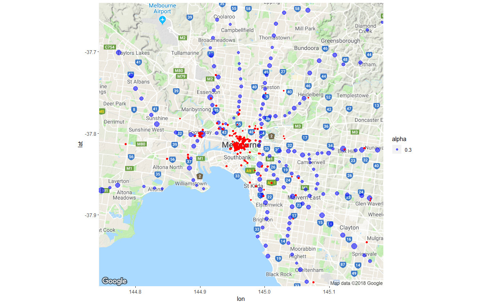
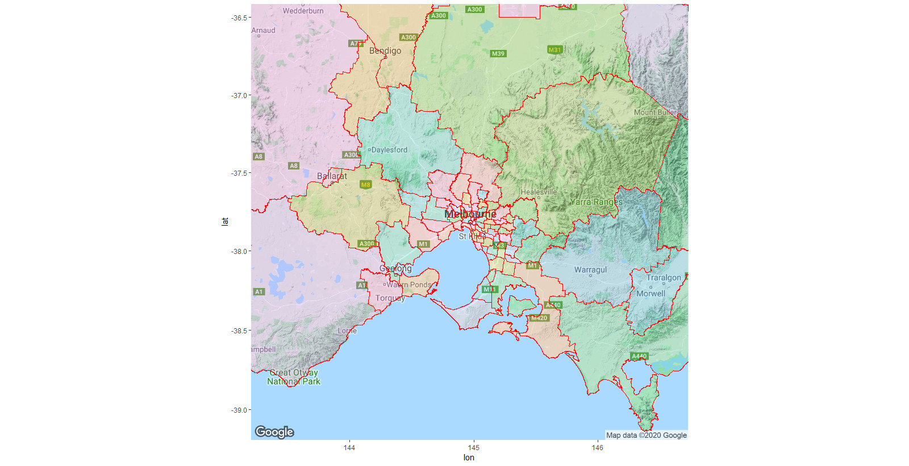
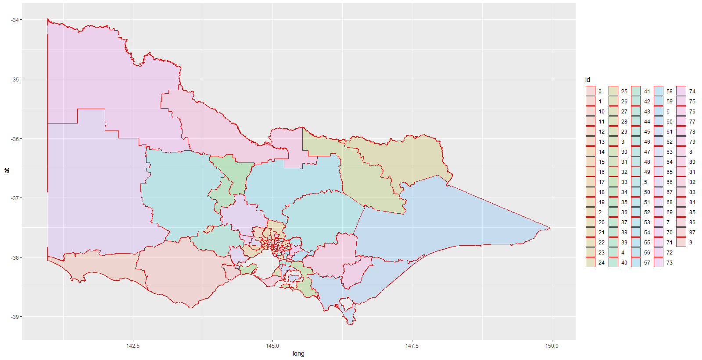

# r-data-analysis-samples

This is a collection of R scripts written for "Datathons" in recent years.

They are all quite hastily written. 

Victorian public transport themed:

**plot_traffic_on_map.R** queries busy train stops and car traffic on a day in 
February 2018 from a BigQuery table and plots it on a Google Map.

**points_in_polygons.R** plots PTV locations inside electorates and loads the 
points back into BigQuery.

**state_govt_maps.R** is a WIP attempt to colour-code Victorian electorates 
based on the voting "swing".

